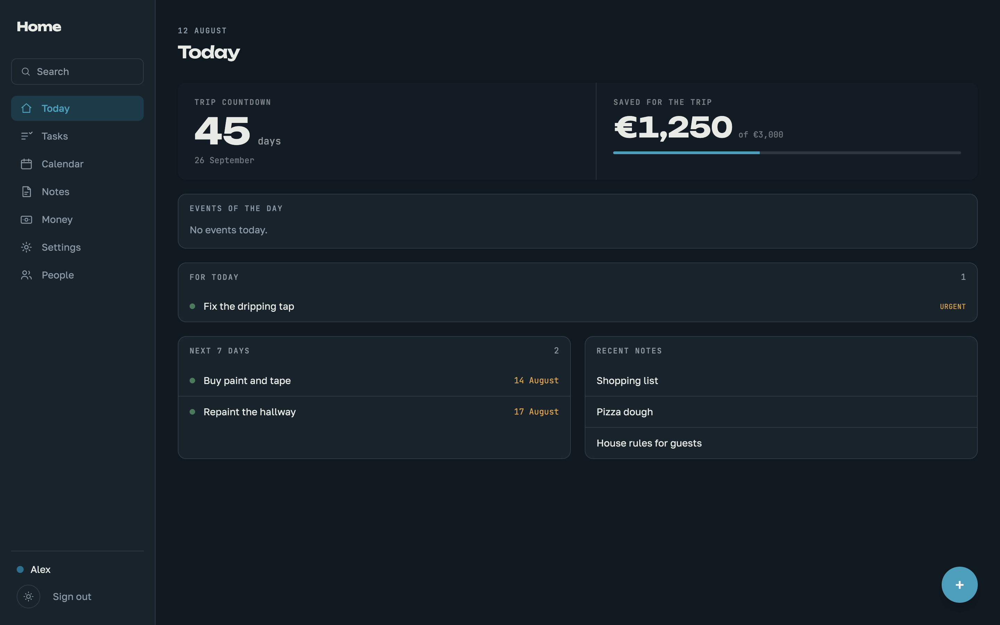
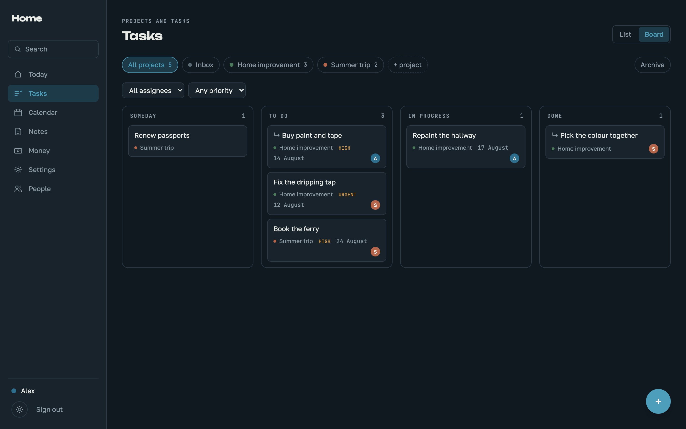
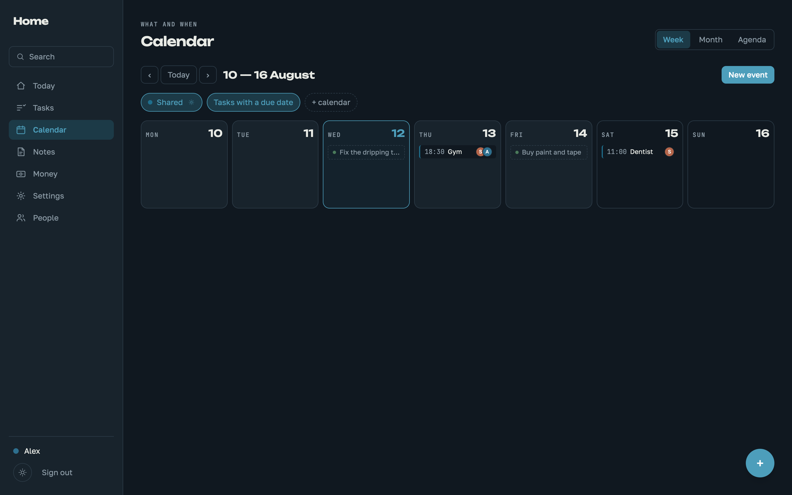
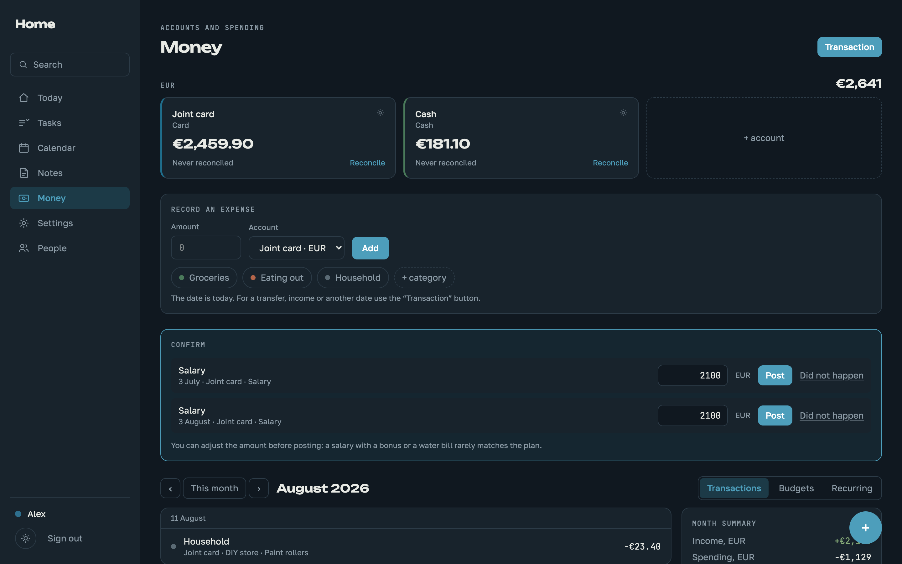
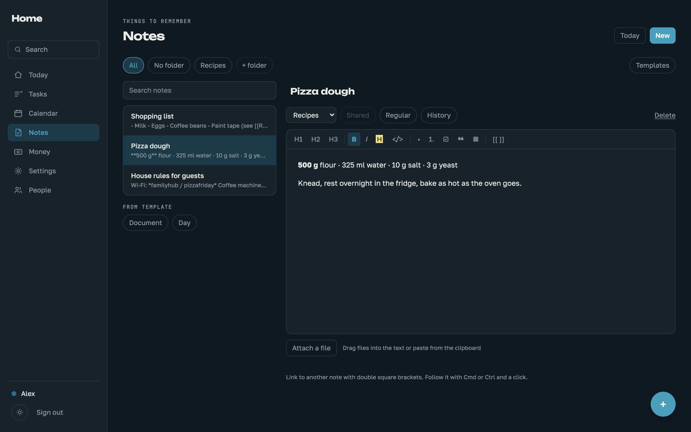

# Family Hub

A self-hosted family hub: tasks, notes, calendar and money in one place. Built for a household, not a corporation: one Docker container, one SQLite file, no external services required. Runs on a home machine over the local network or on a cheap VPS with a real domain.

The core is complete and battle-tested by daily family use: accounts and sign-in (password and Google), projects and tasks with a kanban board, notes with attachments and wiki-links, a calendar with recurring events, full-text search, a dashboard, and a money section — accounts with balances, expenses, income, transfers, bank reconciliation, categories, budgets, recurring transactions, receipts.

## A quick look



<table>
  <tr>
    <td></td>
    <td></td>
  </tr>
  <tr>
    <td></td>
    <td></td>
  </tr>
</table>

## Running it

The hub can run at home (below) or on a VPS with a real domain — the latter has its own step-by-step guide: [DEPLOY.md](DEPLOY.md).

### Development

```bash
npm install
npm run dev
```

Frontend on `http://localhost:5173`, API on `http://localhost:8787`. Vite listens on all interfaces, so tablets and phones on the same network can open `http://<machine-ip>:5173`.

### Prebuilt image

Tagged releases publish a multi-arch image (amd64 + arm64, so Raspberry
Pi works) to GitHub Container Registry:

```bash
docker pull ghcr.io/burtsdenis/family-hub:latest
```

The compose files build from source by default; point `image:` at the
registry tag to skip building.

### Production at home

```bash
cp .env.example .env
docker compose up -d --build
```

The hub comes up on `http://localhost:8787` and is reachable from other devices on the network by the machine's address. The port is exposed directly so everything works without HTTPS.

Next comes HTTPS — browsers require it for secure session cookies, and the planned PWA install/offline support (see Roadmap) will need it too:

```bash
./scripts/setup-https.sh                  # name, certificate, hints
docker compose --profile https up -d      # start Caddy
```

Caddy lives in a separate profile deliberately: it will not start without a certificate, and the certificate only appears after `setup-https.sh`. Starting it together with everything else would mean a broken first run on a clean machine.

After that the hub opens at `https://hub.local` — **no port needed**, Caddy listens on 443 and redirects 80 to https. You can then set `SECURE_COOKIES=true` in `.env`.

### The name on the local network

The `.local` domain is served by Bonjour, and it answers **only to the machine's own name**. An arbitrary name like `hub.local` will not resolve by itself — not on the host, not on an iPad. Editing `/etc/hosts` helps only the machine where it was edited; it is useless for iPads and phones, because iOS has no hosts file.

So the hub's name must match the machine's network name. Check the current one (macOS):

```bash
scutil --get LocalHostName
```

Then either rename the machine — `hub.local` will then work on every device at once:

```bash
sudo scutil --set LocalHostName hub
```

or use the name the machine already has, putting it into `.env`:

```
HUB_HOST=machine-name.local
```

`setup-https.sh` checks this itself, warns, and offers to rename. The name goes into `.env`, and Caddy reads it from there — no manual config editing.

## First run

A hub with an empty database offers to create the first account right in the browser — that account becomes the administrator. Passwords are never printed to server logs.

Family members are added with invitations: the administrator creates a single-use link (valid for a week, shown once, stored as a hash), the person opens it and fills in their own name, login and password. Manual creation with a one-time password remains as a fallback.

Day-to-day work happens under personal accounts. The administrator role manages the system; it has **no access to other people's private notes** — private queries filter by owner, and there is no "if admin, show everything" branch in the code.

### Lost password

```bash
npm run admin:reset                      # for the administrator
npm run admin:reset -- name@hub.local    # for a specific account
```

In Docker: `docker compose exec app node scripts/admin-reset.mjs`

It issues a new password, requires changing it on first sign-in and closes all previous sessions. Before this existed, the only way out of a lost password was deleting the database — losing everything.

## Signing in

Two ways in: password and Google. An account is **never** created via Google: the hub is a family tool, the household is known, a stranger's Google account is refused at the door. Google is linked by an explicit action in Settings, from a live session, and is identified by the account's permanent ID rather than the email address — the email can change, the link survives.

Once linked, password sign-in can be disabled per account in Settings: Google with its protections (prompts, passkeys) guards the entrance better than any password. The mode is invisible from outside — a disabled password answers the same "Wrong login or password" as a merely wrong one, with the same response time.

One invariant always holds: **the administrator's password sign-in cannot be disabled**. It is the emergency door — if a Google account is hijacked, blocked, or Google itself is down, the administrator signs in with the password and restores access by resetting passwords (a reset also re-enables password sign-in). A hub whose only way in runs through an external service is a hub that will one day refuse to open.

## Layout

```
server/               Fastify + SQLite
  src/db/migrations/  Schema. The single source of truth
  src/routes/         API
web/                  React + Vite + Tailwind
scripts/              Certificates and backups
```

Data lives **outside the project folder** — in `~/.family-hub` (or the mounted volume): database, attachments, backups. Replacing the code never touches it.

## Updating

Unpack the new version over the old one, replacing files, then:

```bash
npm install     # dependencies change often
npm run dev
```

The data folder is untouched by updates: users, passwords and content stay in place, initial setup is never needed twice. On the first start of a new version, data from a legacy `./data` folder, if present, migrates automatically.

In development the server restarts itself — both backend and frontend watch files. A manual restart is only needed after `npm install`.

## Database

The schema lives in `.sql` files and is applied at startup. A new migration is a new file with the next number; already-applied ones are never re-run.

Search uses FTS5 with the `trigram` tokenizer. It matches substrings, so Russian (and any) morphology works without a stemmer: "переезд" finds "переезда" and "переездом". The price is a three-character minimum per query.

Database access is plain SQL through better-sqlite3, no ORM. At the scale of a thousand notes an ORM does not pay for itself, while the schema is described in exactly one place and cannot drift from the code.

SQLite's built-in `lower()` and `LIKE` are case-insensitive only for Latin, so task-name search registers a custom `ci_contains` function — it folds case in JavaScript and knows Cyrillic.

Passwords are hashed with scrypt from Node's standard library. The sessions table stores a sha256 of the token, not the token itself: someone who reads the database cannot impersonate anyone.

## Tasks

Three nesting levels: story → task → subtask. The server refuses anything deeper, deliberately — otherwise the tree turns into a dump.

Recurrence uses a subset of RRULE: `FREQ=MONTHLY;INTERVAL=1` and the like. The next date is computed **from the series anchor**, not from the previous occurrence. Otherwise "every 31st" would slip to the 28th forever after February.

Task order is accepted as a full list of IDs (`POST /api/tasks/reorder`) rather than fractional positions between neighbours. At household scale rewriting fifty rows costs nothing, and positions never degrade over time.

`Cmd/Ctrl + K` opens quick-add from any section. A task with no project selected goes to the Inbox.

## Notes

Stored as markdown. The editor is TipTap, but what lands on disk is plain markdown, readable in any text editor.

A link to another note is `[[Title]]`. It is implemented as a decoration over plain text, not a separate schema node: the note stays valid markdown, and a link to a note that does not exist yet is kept "dangling" and picks itself up when a note with that title appears.

Version history is not written on every save — autosave would produce a thousand rows in an evening. A snapshot is taken if more than ten minutes passed since the last one, or if a different person is editing. A rollback also lands in history, so it is reversible.

Templates are ordinary notes with a flag: any note can become a template and back. They stay out of the main list and are offered when creating a new note. A private template follows the same rules as a private note: only its owner can expand it. Placeholders `{{дата}}`, `{{время}}`, `{{автор}}`, `{{изо}}` work in both body and title; they expand once, at creation time, and become plain text. An unknown key is left as-is — a typo never eats content.

### Attachments

Files go to `~/.family-hub/attachments/YYYY-MM/` under generated names; the original name is kept in the database. A human-supplied name never becomes part of a disk path — otherwise `../../` in a name would write anywhere.

The per-file ceiling is 50 MB. Total volume is not hard-limited but is tracked: `GET /api/attachments/usage`.

Files can be dragged straight into note text or pasted from the clipboard. Images land at the drop point and enter the markdown as regular images; other files simply attach.

An attachment is visible to whoever can see the note. Deleting a note removes the files from disk, not just the rows.

A private note is visible only to its owner — in lists, in search, and by direct link. The administrator is no exception. The daily note included: if a private note by someone else already exists for a date, the second person gets an honest refusal, not its content — a second note for the same date cannot exist, the daily date is unique.

## Calendar

Time is stored as local wall-clock time, not UTC. "Every Tuesday at 10:00" must stay at 10:00 after a clock change; storing UTC would force recalculating every series occurrence through DST rules. A household lives in one time zone.

Recurring events expand on the fly per requested range and are never materialised into the database: "every year" with no end date is an infinite table. A single occurrence can be cancelled without touching the series; cancelled dates are kept as an exception list.

Event participants ("who is going") show as circles with the first letter of the name — in the grid, the agenda and the dashboard. Without that, picking participants produced no visible result and looked broken.

A calendar is either shared (visible to all) or personal (visible only to the owner, administrator included). The set of visible layers and the chosen view are remembered per device: a kiosk wants the week, a phone prefers the agenda.

## Search

`Cmd/Ctrl + Shift + F` — across tasks, notes, events, projects and file names. `Cmd + K` stays reserved for quick task adding.

Notes, tasks and projects are searched via FTS5; events and attachments by direct scan with `ci_contains`. Keeping an index for an entity whose visibility depends on calendar settings would create a desynchronisation source; and there are hundreds of events, not tens of thousands.

Private content never appears in someone else's results — not notes, not personal-calendar events, not files attached to them.

## Money

Amounts are stored as integers in minor units: 1234.56 → 123456. Floating point in money produces rounding errors that accumulate in sums and eventually disagree with the bank.

Currency lives on the account, and currencies are unrelated: no exchange rate, no grand total, summing happens strictly within one currency. A transfer between accounts in different currencies records two amounts — what left and what arrived.

Common currencies (EUR, RSD, USD, GBP, CHF, PLN, CZK, SEK, HUF) are one click when creating an account; any other ISO 4217 code can be typed in — the server accepts any, Intl formats it. The default currency for new accounts is a hub setting.

Balances are computed, not stored: opening balance plus movements. A stored balance drifts from history after any backdated edit.

Privacy is attached to the account, not the transaction. An account is shared or personal; a personal account's transactions and balance are visible only to the owner. There is no separate "hidden expense" flag, and thanks to that the shared account's balance is identical for everyone — there are no hidden withdrawals from it. A transfer from a shared account to a personal one is visible to the other person as an amount, without the account name or details: money leaving a shared account cannot be hidden, or the balance would be wrong.

A category with history is hidden, not deleted — otherwise past reports would lose their labels.

### Subcategories

A category can belong to a parent: "Car → Fuel, Parking, Service". The hierarchy is exactly one level deep by design — an arbitrary tree turns every report into recursion, while a family needs a "group → item" pair at most. The server enforces the depth: a subcategory cannot become a parent, and a category with children cannot become a subcategory.

In the month summary subcategories roll up into the parent — its row expands on click into the breakdown, with the parent's own transactions shown as a remainder. The pie chart shows the rolled-up shares, one chart per currency (shares across currencies are meaningless without an exchange rate). Deleting a parent promotes its children to the top level instead of dropping them: transaction labels are worth more than the hierarchy.

Reconciliation: you enter the actual balance from the bank, the app shows the discrepancy. Without it, balance-based accounting falls apart — one missed expense breaks the number. One reconciliation per day: a repeat on the same day updates the previous one instead of adding a twin — what matters is the actual balance on a date, not the history of attempts to enter it.

The discrepancy is computed against the balance **at the moment of reconciliation**, not the current one: transactions recorded after the check do not shift it — the bank will process them too, there is nothing to compare them against. "At the moment" means transactions of earlier dates plus same-day transactions entered before the check. Both sides of the comparison are computed, not stored, so a missed expense entered retroactively recalculates the checked balance and closes the discrepancy — exactly the workflow reconciliation exists for: see a discrepancy, find what was forgotten, enter it, watch it match.

### Budgets

A budget is set per "category + currency" pair. A standing one applies every month; a single-month exception overrides it in that month only.

A budget on a parent category also counts its subcategories' spending: "Car" is fuel, parking and service together. A separate budget on a subcategory is still possible; the two coexist.

### Recurring transactions

A rule is a template, not a history record. What is due is computed by subtraction: all rule dates up to today, minus already-created transactions, minus manually skipped ones. No "next date" cursor is stored — it drifts after a backdated rule edit, while subtraction always gives the same answer.

A unique index on "rule + occurrence date" makes creation idempotent: a repeated run never doubles the rent.

`auto_create = 1` — created automatically (rent: charged on schedule). `auto_create = 0` — lands in the "Confirm" panel, where the amount can be adjusted before posting. Salary defaults to confirmation: it arrives late, and recording it ahead of time would skew the balance exactly when someone is looking at it.

Auto-creation catches up at server startup: the machine may have slept through a date or two.

### Receipts

Attached to a transaction with the same machinery as note attachments. The image is downscaled client-side to 1600 px on the long edge: a phone photo weighs megabytes, and all a receipt needs to show is the amount and the date.

## Interface

Enter in any dialog performs the primary action — save, confirm, add — regardless of where the focus is. In a multi-line field Enter stays a line break; on a button it presses that button. Escape closes. One rule for every window: task card, event, transaction, budget, confirmations.

On a phone the main screen starts with three quick actions: task, expense, note. A phone is pulled out to record something on the go — these three buttons do it in one tap. The task one opens the same quick-add as `Cmd/Ctrl + K`, the expense one opens the transaction form, the note is created and opened immediately. Wide screens do not show the block: they have hotkeys and section buttons.

The sidebar does not scroll with the content: on a long task list the sections stay put, the panel has its own scroll.

"All projects" shows a total open-task counter — the same one each project has individually.

The app's clock is local, on the server too. "Today" on the dashboard, recurring transaction dates and the `{{изо}}` placeholder are computed in the `TZ` time zone, not Greenwich: otherwise everything would live in "yesterday" between midnight and one-two a.m.

The interface speaks English by default; Russian is available in Settings. The first day of the week (Monday or Sunday) is configurable there too. Both are per-device settings: a phone and the shared kiosk can differ.

## Logging

The level is set with `LOG_LEVEL`: `debug` · `info` · `warn` · `error` · `silent`. **The default is `warn`** — in normal operation only warnings and errors are interesting.

Fastify's built-in logger is disabled entirely. It wrote a JSON line per request, pid and hostname included; on a home server polled by a kiosk once a minute that is noise in which a real error disappears.

What is written at which level:

| Level | What you see |
|---|---|
| `debug` | plus a line per request with duration |
| `info` | plus one-off events like created recurring transactions and sign-ins with IPs |
| `warn` | 4xx responses: something not found, something failed validation |
| `error` | 5xx responses with stack traces, crashes, an occupied port |
| `silent` | nothing |

The format is one line: `12:31:19 WARN  404 GET /api/nope`.

One-off critical messages print **regardless of level**, even at `silent`: applied migrations are the only trace that the database changed, and the startup line says the server is up.

Malformed path or query parameters answer 400 and log as `WARN`. Previously that crashed with a 500 and looked like a server error in the log.

## Moving to another machine

On the old machine:

```bash
npm run export -- ~/Desktop
```

This produces `family-hub-YYYY-MM-DD.tar.gz`: the database, attachments and a manifest. No need to stop the server — the database is exported via `VACUUM INTO`, i.e. opened as a database rather than copied as a file. A plain copy of `hub.db` would lose fresh writes: they live in the WAL journal next to it.

Transfer the archive however you like. It contains everything, private notes and personal accounts included.

On the new machine:

```bash
npm install
npm run import -- ~/Downloads/family-hub-2026-08-03.tar.gz
npm run dev
```

Before swapping anything, the import verifies database integrity and checks the contents against the manifest — a corrupted database is better not installed at all. If the new machine already has data, the import refuses and suggests `--force`; the previous database is not deleted but set aside as `hub-before-import-DATE.db`.

Passwords, accounts and content move wholesale; initial setup is never needed twice. Separately on the new machine you will need: its own certificate (`./scripts/setup-https.sh` — each machine has its own local CA), the `.env` if there was one, and the `pmset` wake schedule if you use one.

### Intel Macs

The project runs on them with no performance caveats: Node 22 and `better-sqlite3` build for x64, Rosetta is not needed. macOS 11 or newer is required. If a prebuilt `better-sqlite3` for the system is unavailable, Xcode tools are needed: `xcode-select --install`.

## Operations

The machine should wake up for the morning (macOS):

```bash
sudo pmset repeat wakeorpoweron MTWRFSU 06:30:00
```

Nightly backup at 03:00 — a database snapshot, notes exported to markdown, `age` encryption, a push to a private repository:

```bash
crontab -e
0 3 * * * cd /path/to/family-hub && AGE_RECIPIENT=age1... ./scripts/backup.sh
```

Attachments do not go to git — a machine-level backup (e.g. Time Machine) covers them.

Once a quarter, unpack a backup into a separate folder and make sure it opens. A backup that has never been restored is a backup only nominally.

## Demo mode

`DEMO_MODE=true` turns the hub into a public sandbox where **every
visitor gets their own throwaway copy** of a seeded sample family. One
button to enter — no password. Under the hood the app builds a template
database at startup (migrations + seeding, rebuilt daily so dates stay
fresh) and clones it per visitor; a sandbox disappears after a couple of
idle hours, on sign-out, or when the app restarts. Visitors can create,
edit and delete anything — nobody else will ever see it, which is the
point: a shared demo is a graffiti wall by lunchtime. Password and
membership changes and file uploads stay blocked. Deployment next to a
production hub: DEPLOY.md, "Public demo".

## Roadmap

Money: CSV bank-statement import. From the original spec: PWA offline mode with a home-screen icon, a kiosk mode for tablets, the morning brief, shared lists, an encrypted private section for documents. Housekeeping: translating code comments to English.

## License

[AGPL-3.0](LICENSE). Run it, change it, share it — but if you offer a
modified version to others as a service, its source must be open too.
